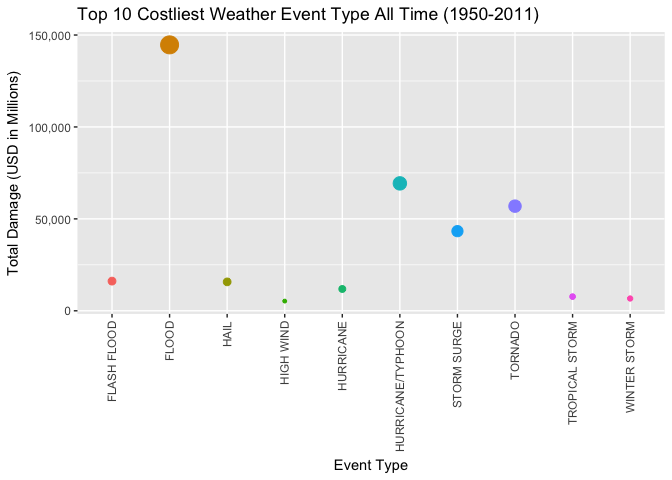
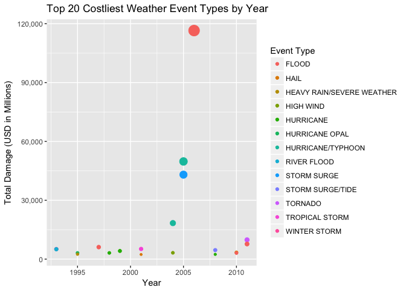

# Nature Events and Their Impact to Our Society
by Jiani  
21 Dec, 2017  

### Synopsis

Extreme weather events have huge impact on our society. To have a quick look at which are the deadliest and the costliest in the United States, we use the Storm Data provided by the U.S. National Oceanic and Atmospheric Administration's (NOAA). Between 1950 and 2011, of all the recorded significant weather events **Tornado** caused most fatalities and injuries while **Flood** is the most costliest.

### About the Data Source

The weather event data (storm.zip) and information documents (Doc & FAQ) used in this paper is from the Data Science course **Reproducible Research** week 4 peer assignment project (see code chunk for URLs). The events in the database start in the year 1950 and end in November 2011. 

In the weather event data, there are data about type of weather event, the start and end time, fatalities, injured, property damages, event locations, etc.

### Data Processing

Download and process data packages after loading needed R packages.


```r
library(data.table)
library(dplyr)
```

```
## 
## Attaching package: 'dplyr'
```

```
## The following objects are masked from 'package:data.table':
## 
##     between, first, last
```

```
## The following objects are masked from 'package:stats':
## 
##     filter, lag
```

```
## The following objects are masked from 'package:base':
## 
##     intersect, setdiff, setequal, union
```

```r
library(ggplot2)
library(knitr)
library(lubridate)
```

```
## 
## Attaching package: 'lubridate'
```

```
## The following objects are masked from 'package:data.table':
## 
##     hour, isoweek, mday, minute, month, quarter, second, wday,
##     week, yday, year
```

```
## The following object is masked from 'package:base':
## 
##     date
```

Download data and information documents. Add variable of Start Year `BGN_Year`to the data table.


```r
url <- "https://d396qusza40orc.cloudfront.net/repdata%2Fdata%2FStormData.csv.bz2"
download.file(url,
              destfile='storm.zip',
              method="curl",
              mode="wb") 
dfStorm <- read.csv("storm.zip")

urlDoc <-"https://d396qusza40orc.cloudfront.net/repdata%2Fpeer2_doc%2Fpd01016005curr.pdf"
download.file(urlDoc,
              destfile = 'Doc.pdf',
              method = 'curl',
              mode='wb') 

urlFAQ <-"https://d396qusza40orc.cloudfront.net/repdata%2Fpeer2_doc%2FNCDC%20Storm%20Events-FAQ%20Page.pdf"
download.file(urlFAQ,
              destfile = 'FAQ.pdf',
              method = 'curl',
              mode='wb') 

dfStorm$BGN_Year <- as.numeric(format(as.Date(dfStorm$BGN_DATE, "%m/%d/%Y"),"%Y"))
```

### Most Harmful Event Type for Public Health (1950-2011)

Here we look at both death tolls (variable `FATALITIES`) and the number of people who were injured (variable `INJURIES`) throughout the entire record period. Some earlier years had less record and later years the record was more complete.

The result shows **Tornado** caused most fatalities and injured combined. No. 2 most harmful would be **Excessive Heat**.


```r
Top10Harmful <- dfStorm %>% 
        group_by (EVTYPE) %>% 
        summarise(totalAll = sum(FATALITIES)+sum(INJURIES)) %>%
        arrange(-totalAll) %>%
        slice(1:10)

Top10Harmful
```

```
## # A tibble: 10 x 2
##               EVTYPE totalAll
##               <fctr>    <dbl>
##  1           TORNADO    96979
##  2    EXCESSIVE HEAT     8428
##  3         TSTM WIND     7461
##  4             FLOOD     7259
##  5         LIGHTNING     6046
##  6              HEAT     3037
##  7       FLASH FLOOD     2755
##  8         ICE STORM     2064
##  9 THUNDERSTORM WIND     1621
## 10      WINTER STORM     1527
```

### Event Type with Greatest Economic Consequence - the Costliest

#### Calculate Property Damage

Because Property Damage `PROPDMG` shows numbers in either by thousands (K), millions (M) or billions (B), it is necessary to calculate the total numerical value of damages using Property Damage Expressions `PROPDMGEXP`. 


```r
dfStormDamage_K <- dfStorm %>%
        select(EVTYPE, PROPDMG, PROPDMGEXP, REFNUM, BGN_Year) %>%
        filter(PROPDMGEXP == 'K') %>%
        mutate(Total = PROPDMG*1000)

dfStormDamage_M <- dfStorm %>%
        select(EVTYPE, PROPDMG, PROPDMGEXP, REFNUM, BGN_Year) %>%
        filter(PROPDMGEXP == 'M') %>%
        mutate(Total = PROPDMG*1000000)

dfStormDamage_B <- dfStorm %>%
        select(EVTYPE, PROPDMG, PROPDMGEXP, REFNUM, BGN_Year) %>%
        filter(PROPDMGEXP == 'B') %>%
        mutate(Total = PROPDMG*1000000000)

dfStormDamage <- bind_rows(dfStormDamage_B, dfStormDamage_M, dfStormDamage_K)

rm(dfStormDamage_K, dfStormDamage_M, dfStormDamage_B)
```

If we look at the total damage by event type, we got **Flood** as the most costliest event type of all times.

Because of the aggregated damage value for top 10 event types are fairly large, all numbers are presented in Millions of USD.


```r
Top10Damage <- dfStormDamage %>%
        group_by (EVTYPE) %>% 
        summarise(TotalDamage = sum(Total)) %>%
        arrange(-TotalDamage) %>%
        slice(1:10) 

div=1000000

ggplot(Top10Damage, aes(EVTYPE,TotalDamage/div)) +
        geom_point(aes(color = EVTYPE, size = TotalDamage)) +
        labs(title='Top 10 Costliest Weather Event Type All Time (1950-2011)',
             x='Event Type',
             y='Total Damage (USD in Millions)') +
        scale_y_continuous(labels=function(y) 
                format(y, big.mark=",", scientific=FALSE)) +
        theme(legend.position="none",
              axis.text.x = element_text(angle=90, vjust = 0.5, hjust = 1))
```

<!-- -->

If we want to look further into which year and which type of event caused most damage financially, we calculate a new data table for Top 20 Costliest Event Type per Year . Here we see that **Flood** in **2006** shows the costliest event of all times.


```r
dfDamage_byYear <- dfStormDamage %>%
        group_by (EVTYPE, BGN_Year) %>% 
        summarise(TotalDamage = sum(Total)) %>%
        arrange(-TotalDamage)

Top20Damage_byYear <- dfDamage_byYear[1:20,]

ggplot(Top20Damage_byYear, aes(x=BGN_Year, y=TotalDamage/div, fill=TotalDamage)) +
        geom_point(aes(color = EVTYPE, size = TotalDamage)) +
        labs(title='Top 20 Costliest Weather Event Types by Year',
             x='Year',
             y='Total Damage (USD in Millions)') +
        scale_y_continuous(labels=function(y) 
                format(y, big.mark=",", scientific=FALSE)) +
        guides(fill='none', size='none') +
        scale_color_discrete(name="Event Type")
```

<!-- -->


